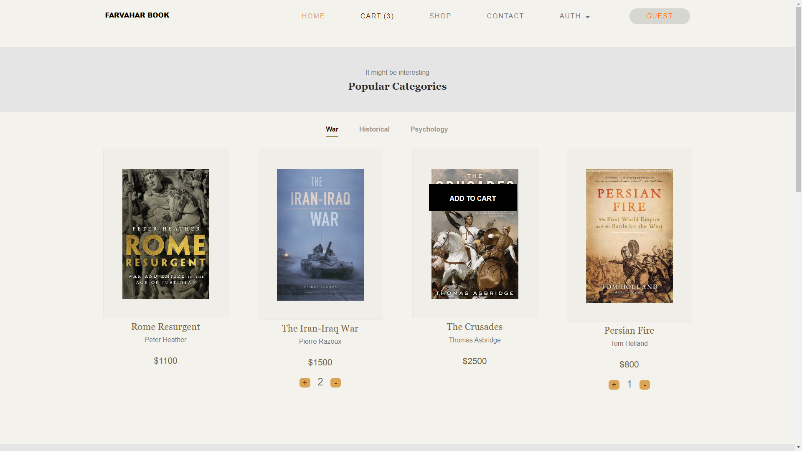
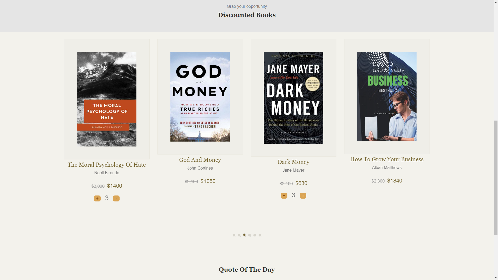
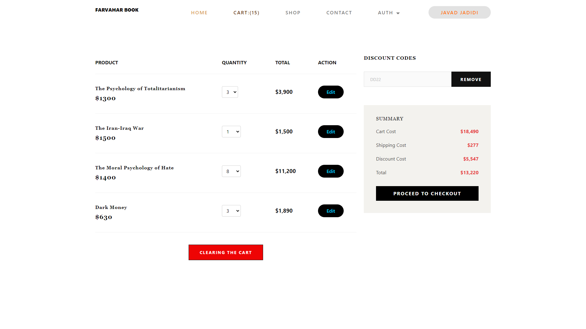
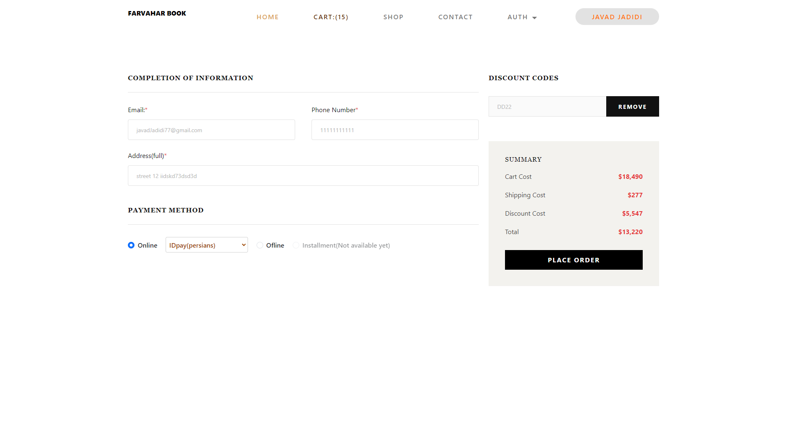
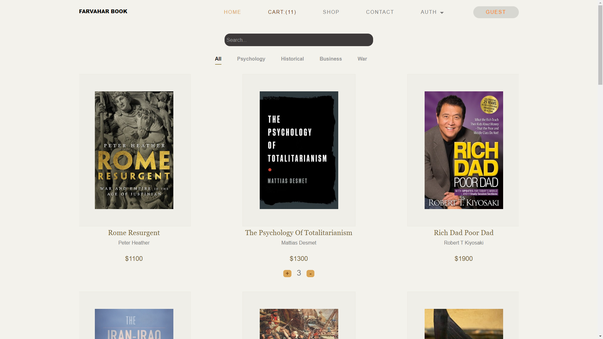
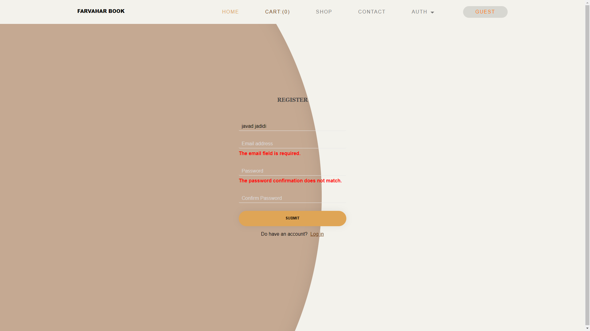
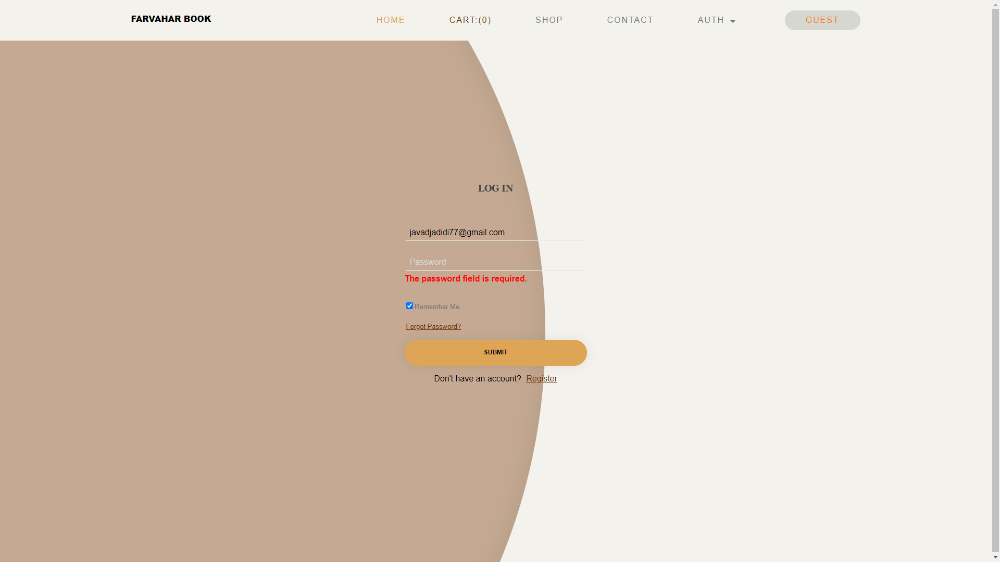
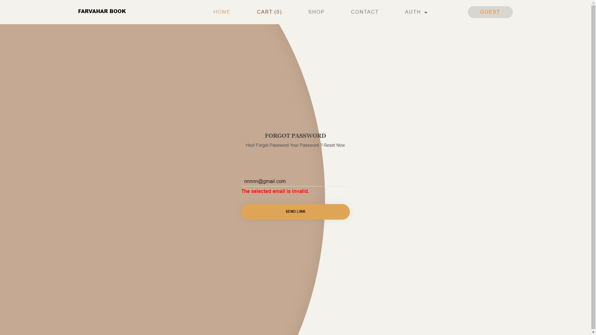

# Book Web Store

This E-commerce project built on Laravel. 
See database design => https://dbdiagram.io/d/63b47ef47d39e42284e8b550

## Used Technologies
* PHP / Laravel
* Mysql 
* Bootstrap
* Html
* Css 
* javascript

## Important Design Patterns Used
* Decorator design pattern 
* Chain of responsibility design pattern 

## About This Project
* Users can register / log in / log out / reset password.
* Users can navigate on the main page and viewing the best categories and discounted products.
* Users can see the information of a product(showcase) anywhere in the store and add or remove them to their cart.
* Users can add the product to their cart or remove it from their cart.
* Users can browse products based on categories on the shop page.
* Users can search for the product according to the specified criteria.
* Users can apply and remove the discount coupon on the shop page or checkout page and see the reduced price.
* Users can edit / clear their cart on the cart page.
* Users can order their cart after completing the information on the checkout page.
* Users can pay their order online(with gateway) and offline and receive order information by email.
* Admin in the admin panel can view the list of [products , users , categories] and delete / add / edit a [product , category , user].
* The admin in the admin panel can manage payments and orders.

## Demo

Main page_1      |  Main page_2
:------------------------:|:-------------------------:
  |  

Cart     |  Checkout
:------------------------:|:-------------------------:
  |  

Shopping     |  Registration and authorization
:------------------------:|:-------------------------:
  |  

Log in    |  Reset password
:------------------------:|:-------------------------:
  |  